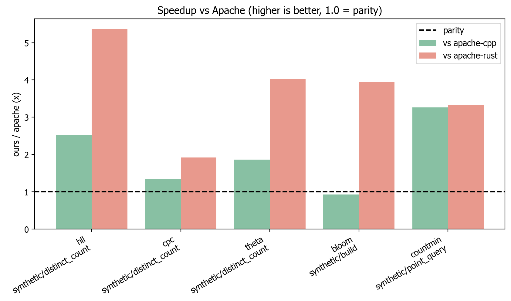
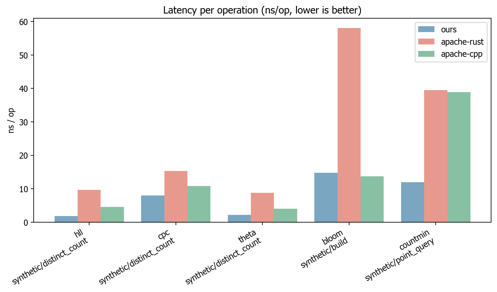

# `sketches`: Probabilistic Data Structures, in Rust

[](https://www.rust-lang.org)
[](https://python.org)
[](LICENSE.md)

**Fast, memory-efficient probabilistic data structures for streaming analytics, cardinality estimation, quantile computation, and sampling.**

Python bindings for Rust-based implementations of HyperLogLog, T-Digest, Reservoir Sampling, and more via PyO3.

**[Algorithm Deep Dive](ALGORITHMS.md)**

## Features

| **Algorithm Category**     | **Implementation** | **Description**                                                 |
| -------------------------- | ------------------ | --------------------------------------------------------------- |
| **Cardinality Estimation** | HyperLogLog (HLL)  | Industry-standard distinct counting with ~1% error              |
|                            | HyperLogLog++      | Enhanced HLL with bias correction and sparse mode               |
|                            | CPC Sketch         | Most compact serialisation for network transfer                 |
|                            | Linear Counter     | Optimal for small cardinalities (n < 1000)                      |
|                            | Hybrid Counter     | Auto-transitions from Linear to HLL                             |
| **Set Operations**         | Theta Sketch       | Union, intersection, difference with cardinality estimation     |
| **Sampling**               | Algorithm R        | Basic reservoir sampling for uniform random samples             |
|                            | Algorithm A        | Optimised reservoir sampling (19x faster for large streams)     |
|                            | Weighted Sampling  | Probability-proportional reservoir sampling                     |
|                            | Stream Sampling    | High-throughput sampling with batching                          |
| **Quantile Estimation**    | T-Digest           | Superior accuracy for extreme quantiles (p95, p99)              |
|                            | KLL Sketch         | Provable error bounds (~1.65% at k=200)                         |
| **Frequency Estimation**   | Count-Min Sketch   | Conservative frequency estimation with epsilon-delta guarantees |
|                            | Count Sketch       | Unbiased frequency estimation using median                      |
|                            | Frequent Items     | Top-K heavy hitters with Space-Saving algorithm                 |
| **Membership Testing**     | Bloom Filter       | Fast membership testing with configurable false positive rate   |
|                            | Counting Bloom     | Bloom filter with deletion support                              |
| **Multi-dimensional**      | Array of Doubles   | Tuple sketch for multi-dimensional aggregation                  |

**Mergeable** means two independently built sketches can be combined into one that represents the union of both input streams, without access to the original data. This is essential for distributed systems where data is partitioned across nodes -- each node builds a local sketch, then all sketches are merged into a single result.

## Install

The package is not yet published to PyPI (the reserved name is `rusty-sketches`); install from source for now.

```bash
git clone https://github.com/tallamjr/sketches.git
cd sketches
pip install .
```

For an editable install with development dependencies and the maturin build:

```bash
pip install -e .[dev]
maturin develop
```

## Quickstart

```python
from sketches import HllSketch

sketch = HllSketch(lg_k=12)
for item in ["apple", "banana", "orange", "apple"]:
    sketch.update(item)

print(f"Estimated unique items: {sketch.estimate():.2f}")
```

See the [usage guide](docs/usage.md) for every sketch with runnable examples.

## Choosing the right sketch

Different problems call for different sketches. Use this guide to pick the right one for your use case.

| Problem                   | "How do I know if..."                        | Small Scale                   | Large Scale                                 | Distributed / Mergeable           |
| ------------------------- | -------------------------------------------- | ----------------------------- | ------------------------------------------- | --------------------------------- |
| **Membership**            | "Is X in the set?"                           | `BloomFilter`                 | `CountingBloomFilter` (if deletions needed) | Yes, union via bitwise OR         |
| **Cardinality**           | "How many unique items?"                     | `LinearCounter` (n < 1000)    | `HllSketch` / `HllPlusPlusSketch`           | Yes, register-wise max            |
| **Cardinality + Set Ops** | "What's the overlap between A and B?"        | `ThetaSketch`                 | `ThetaSketch`                               | Yes, union, intersect, difference |
| **Compact Cardinality**   | "Unique count with minimal serialised size?" | `CpcSketch`                   | `CpcSketch`                                 | Yes, sketch merging               |
| **Frequency**             | "What are the top-K items?"                  | `FrequentStringsSketch`       | `CountMinSketch` / `CountSketch`            | Yes, entry-wise addition          |
| **Quantiles**             | "What's the p99 latency?"                    | `KllSketch` (provable bounds) | `TDigest` (extreme quantile accuracy)       | Yes, digest merging               |
| **Sampling**              | "Give me a random subset"                    | `ReservoirSamplerR`           | `ReservoirSamplerA` (19x faster)            | Partial, merge samplers           |
| **Weighted Sampling**     | "Sample proportional to weight"              | `WeightedReservoirSampler`    | `VarOptSketch` (Horvitz-Thompson)           | Yes, VarOpt merge                 |
| **Multi-dimensional**     | "Aggregate multiple metrics per key"         | `AodSketch`                   | `AodSketch`                                 | Yes, summary merging              |

**Key trade-offs:**

- **HLL vs Theta**: HLL is more memory-efficient for pure cardinality. Theta supports set operations (union, intersection, difference).
- **HLL vs CPC**: CPC achieves ~40% smaller serialised size but is more complex. Use CPC when network transfer cost matters.
- **Count-Min vs Count Sketch**: Count-Min always overestimates (conservative). Count Sketch is unbiased but uses more space.
- **KLL vs T-Digest**: KLL has provable error bounds (~1.65% at k=200). T-Digest excels at extreme quantiles (p99, p99.9) but bounds are empirical.
- **Algorithm R vs A**: Both produce uniform samples. Algorithm A skips items probabilistically, making it ~19x faster for large streams.

## Performance

At N = 1,000,000 our xxh3-backed default beats hand-tuned Apache C++ on four of
the five shared sketches and beats the Apache Rust crate on all five. On
accuracy, HLL, Theta and CPC are at parity-or-better with Apache DataSketches by
multi-trial RMSE.



In absolute terms, time per operation (lower is better): an HLL update is about 1.8 ns for us versus 4.6 ns for Apache C++.



See [docs/benchmarks.md](docs/benchmarks.md) for the full methodology, all plots, and the throughput and memory views.

## Documentation

- [Background: probabilistic data structures](docs/background.md)
- [Usage guide](docs/usage.md)
- [Design and architecture](docs/design.md)
- [Benchmarks](docs/benchmarks.md)

## Roadmap

Planned but not yet implemented:

- **Similarity estimation**: MinHash, SimHash, an LSH framework.
- **Performance**: SIMD-accelerated register updates (the implementation is currently pure scalar Rust).
- **Integration**: Polars custom expressions and DataFrame operations.

Current priorities: MinHash first (fills the similarity gap), then Polars expressions, then batch operations for the Python bindings.

## License

This project is licensed under the MIT License (see `pyproject.toml`).
