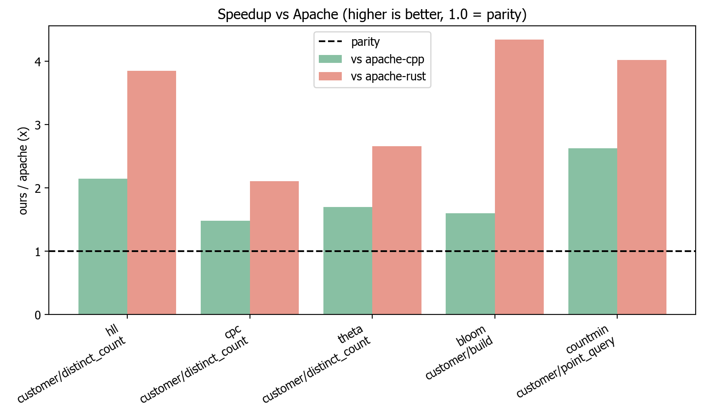
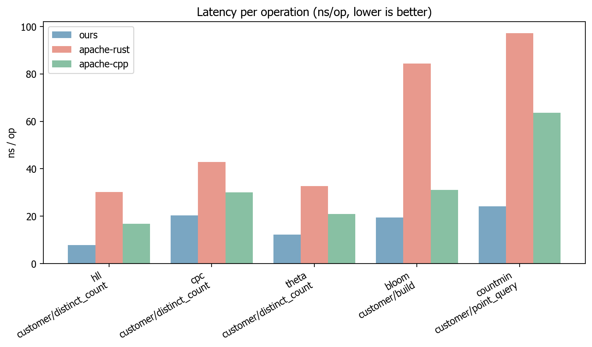

# `sketches`: Probabilistic Data Structures, in Rust

[](https://www.rust-lang.org)
[](https://python.org)
[](LICENSE.md)

**Fast, memory-efficient probabilistic data structures for streaming analytics, cardinality estimation, quantile computation, and sampling.**

Python bindings for Rust-based implementations of HyperLogLog, T-Digest, Reservoir Sampling, and more via PyO3.

**[Algorithm Deep Dive](docs/algorithms.md)**

## Features

| **Algorithm Category**     | **Implementation** | **Description**                                                 |
| -------------------------- | ------------------ | --------------------------------------------------------------- |
| **Cardinality Estimation** | HyperLogLog (HLL)  | Industry-standard distinct counting with ~1% error              |
|                            | HyperLogLog++      | Enhanced HLL with bias correction and sparse mode               |
|                            | CPC Sketch         | Most compact serialisation for network transfer                 |
|                            | Linear Counter     | Optimal for small cardinalities (n < 1000)                      |
|                            | Hybrid Counter     | Auto-transitions from Linear to HLL                             |
| **Set Operations**         | Theta Sketch       | Union, intersection, difference with cardinality estimation     |
| **Sampling**               | Algorithm R        | Basic reservoir sampling for uniform random samples             |
|                            | Algorithm A        | Optimised reservoir sampling (Vitter, skips items probabilistically) |
|                            | Weighted Sampling  | Probability-proportional reservoir sampling                     |
|                            | Stream Sampling    | High-throughput sampling with batching                          |
| **Quantile Estimation**    | T-Digest           | Superior accuracy for extreme quantiles (p95, p99)              |
|                            | KLL Sketch         | Provable error bounds (~1.65% at k=200)                         |
| **Frequency Estimation**   | Count-Min Sketch   | Conservative frequency estimation with epsilon-delta guarantees |
|                            | Count Sketch       | Unbiased frequency estimation using median                      |
|                            | Frequent Items     | Top-K heavy hitters with Space-Saving algorithm                 |
| **Membership Testing**     | Bloom Filter       | Fast membership testing with configurable false positive rate   |
|                            | Counting Bloom     | Bloom filter with deletion support                              |
| **Multi-dimensional**      | Array of Doubles   | Tuple sketch for multi-dimensional aggregation                  |

**Mergeable** means two independently built sketches can be combined into one that represents the union of both input streams, without access to the original data. This is essential for distributed systems where data is partitioned across nodes -- each node builds a local sketch, then all sketches are merged into a single result.

## Install

The package is published on PyPI as `rusty-sketches` (the `sketches` name was taken); the import name is `sketches`.

```bash
pip install rusty-sketches
```

To build from source instead:

```bash
git clone https://github.com/tallamjr/sketches.git
cd sketches
pip install .
```

For an editable install with development dependencies and the maturin build:

```bash
pip install -e .[dev]
maturin develop
```

## Quickstart

Stream a real text through two sketches at once: a HyperLogLog for the distinct word count (a few kilobytes of state, not a full set) and a Frequent Items sketch for the top words. Check the distinct estimate against the truth:

```python
import re
import urllib.request

from sketches import HllSketch, FrequentStringsSketch

# Download a public-domain book (Alice's Adventures in Wonderland).
url = "https://www.gutenberg.org/files/11/11-0.txt"
request = urllib.request.Request(url, headers={"User-Agent": "sketches-quickstart"})
text = urllib.request.urlopen(request, timeout=30).read().decode("utf-8", "ignore")
words = re.findall(r"[a-z']+", text.lower())

distinct = HllSketch(lg_k=12)                  # cardinality
frequent = FrequentStringsSketch(256, False)   # top-k frequency (Space-Saving)
for word in words:
    distinct.update(word)
    frequent.update(word)

exact = len(set(words))
print(f"Total words processed:  {len(words):,}")
print(f"Estimated unique words: {distinct.estimate():,.0f}")
print(f"Actual unique words:    {exact:,}")
print(f"Relative error:         {abs(distinct.estimate() - exact) / exact:.2%}")
print("Top 5 words (estimated count):")
for word, count, _lower, _upper in frequent.get_top_k(5):
    print(f"  {word:<5} {count:,}")
```

```text
Total words processed:  27,439
Estimated unique words: 2,552
Actual unique words:    2,579
Relative error:         1.05%
Top 5 words (estimated count):
  the   1,589
  and   810
  to    665
  a     573
  it    531
```

See the [usage guide](docs/usage.md) for every sketch with runnable examples.

## Choosing the right sketch

Different problems call for different sketches. Use this guide to pick the right one for your use case.

| Problem                   | "How do I know if..."                        | Small Scale                   | Large Scale                                 | Distributed / Mergeable           |
| ------------------------- | -------------------------------------------- | ----------------------------- | ------------------------------------------- | --------------------------------- |
| **Membership**            | "Is X in the set?"                           | `BloomFilter`                 | `CountingBloomFilter` (if deletions needed) | Yes, union via bitwise OR         |
| **Cardinality**           | "How many unique items?"                     | `LinearCounter` (n < 1000)    | `HllSketch` / `HllPlusPlusSketch`           | Yes, register-wise max            |
| **Cardinality + Set Ops** | "What's the overlap between A and B?"        | `ThetaSketch`                 | `ThetaSketch`                               | Yes, union, intersect, difference |
| **Compact Cardinality**   | "Unique count with minimal serialised size?" | `CpcSketch`                   | `CpcSketch`                                 | Yes, sketch merging               |
| **Frequency**             | "What are the top-K items?"                  | `FrequentStringsSketch`       | `CountMinSketch` / `CountSketch`            | Yes, entry-wise addition          |
| **Quantiles**             | "What's the p99 latency?"                    | `KllSketch` (provable bounds) | `TDigest` (extreme quantile accuracy)       | Yes, digest merging               |
| **Sampling**              | "Give me a random subset"                    | `ReservoirSamplerR`           | `ReservoirSamplerA` (Vitter, skips items)   | Partial, merge samplers           |
| **Weighted Sampling**     | "Sample proportional to weight"              | `WeightedReservoirSampler`    | `VarOptSketch` (Horvitz-Thompson)           | Yes, VarOpt merge                 |
| **Multi-dimensional**     | "Aggregate multiple metrics per key"         | `AodSketch`                   | `AodSketch`                                 | Yes, summary merging              |

**Key trade-offs:**

- **HLL vs Theta**: HLL is more memory-efficient for pure cardinality. Theta supports set operations (union, intersection, difference).
- **HLL vs CPC**: CPC achieves ~40% smaller serialised size but is more complex. Use CPC when network transfer cost matters.
- **Count-Min vs Count Sketch**: Count-Min always overestimates (conservative). Count Sketch is unbiased but uses more space.
- **KLL vs T-Digest**: KLL has provable error bounds (~1.65% at k=200). T-Digest excels at extreme quantiles (p99, p99.9) but bounds are empirical.
- **Algorithm R vs A**: Both produce uniform samples. Algorithm A skips items probabilistically (Vitter), which is much faster than Algorithm R for large streams.

## Performance

Measured on a stabilised harness (the median over independent rounds with a 95%
bootstrap confidence interval), our xxh3-backed default leads Apache DataSketches
across the board. On real TPC-H string columns we beat hand-tuned Apache C++ on
every one of the five shared sketches, and beat the Apache Rust crate on all five
by wider margins. Accuracy stays at parity: HLL, Theta and CPC match Apache
DataSketches within the run-to-run noise band by multi-trial RMSE, all at or below
the `1/sqrt(k)` floor.

Speedup over Apache on a real TPC-H column (the `c_address` field of a `customer`
table, about 150k distinct strings, generated with
[tpchgen-rs](https://github.com/clflushopt/tpchgen-rs)), where every bar clears
the parity line:



The same lead in absolute time on that TPC-H column: a single HLL update takes
roughly 7.7 ns with this library against 16.7 ns for Apache C++ (lower is better).



**What we benchmark against.** The references are the official Apache
implementations built and run locally: `apache/datasketches-cpp` at master
`3.2.0-858-g0bab259` (2026-06-19), built with cmake/g++ at C++11, and the
official Apache Rust `datasketches` crate. Each runner emits one shared CSV
schema over identical datasets, and the C++ runner has a startup self-check that
aborts if its measurement scaffolding is miscompiled. Throughput is the median
over independent rounds with a 95% bootstrap confidence interval; accuracy is
multi-trial RMSE.

See [docs/benchmarks.md](docs/benchmarks.md) for the full methodology, the reproduction steps, and the throughput, memory and accuracy plots.

## Documentation

- [Background: probabilistic data structures](docs/background.md)
- [Usage guide](docs/usage.md)
- [Design and architecture](docs/design.md)
- [Benchmarks](docs/benchmarks.md)
- [Algorithm deep dive](docs/algorithms.md)
- [Comparison and prior art](docs/comparison.md)

## Roadmap

Planned but not yet implemented:

- **Similarity estimation**: MinHash, SimHash, an LSH framework.
- **Performance**: SIMD-accelerated register updates (the implementation is currently pure scalar Rust).
- **Integration**: Polars custom expressions and DataFrame operations.

Current priorities: MinHash first (fills the similarity gap), then Polars expressions, then batch operations for the Python bindings.

## License

This project is licensed under the MIT License (see `pyproject.toml`).
