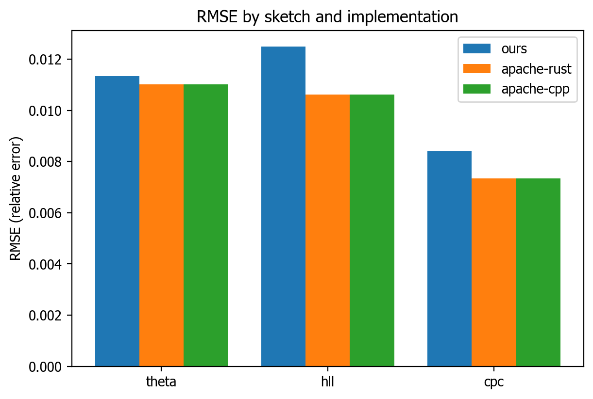
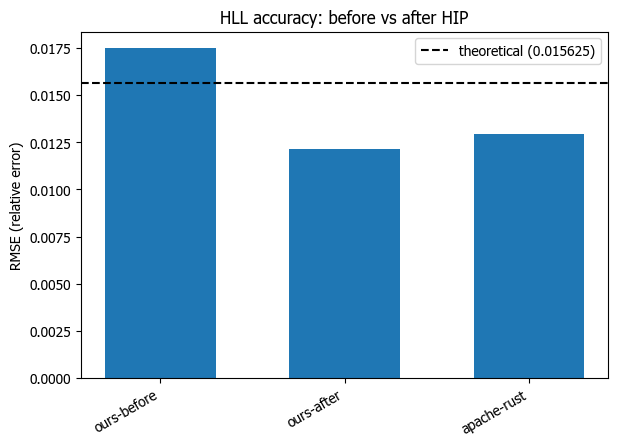
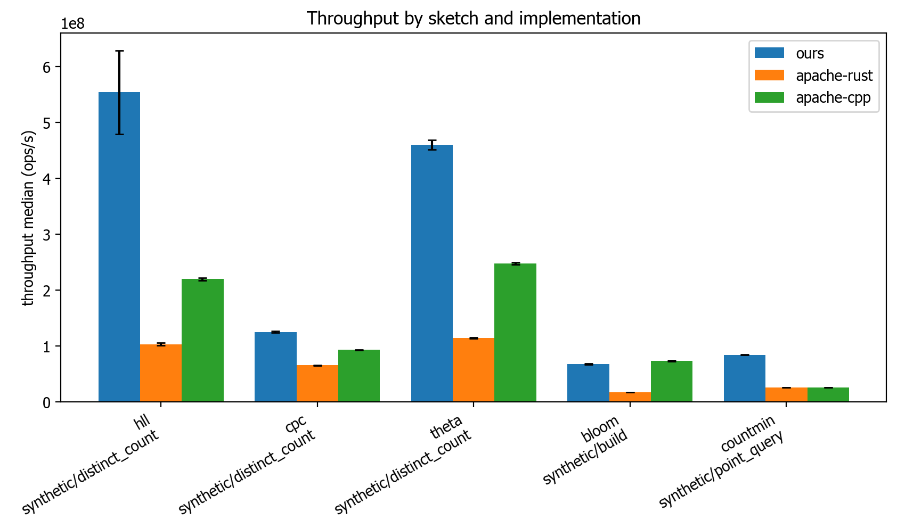
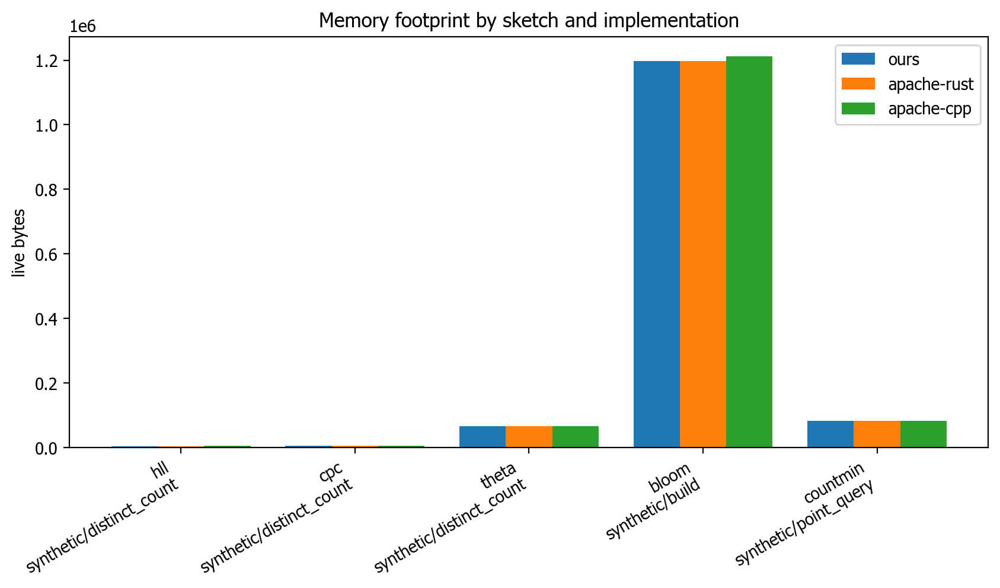

# Benchmarks

[Back to the README](../README.md)

All figures come from the stabilised harness in `benchmarks/`: throughput is the median over independent rounds with a 95% bootstrap confidence interval, and accuracy is multi-trial RMSE. Numbers are machine-dependent; regenerate them with the harness.

## Performance

**Accuracy is measured by multi-trial RMSE, not single runs.** A single accuracy comparison against Apache is statistically meaningless: the spread between trials is larger than the gap between implementations. Earlier versions of the documentation quoted single-run figures, which have been removed. The numbers below come from the benchmark harness running 100 trials of 100,000 distinct items at `lg_k = 12` (4096 registers), and are regenerable with `make -C benchmarks rmse`.

### Accuracy (multi-trial RMSE)

The theoretical error floor for `lg_k = 12` is `1/sqrt(4096) = 0.0156`. Relative-error RMSE over 100 trials x 100,000 distinct items:

| Sketch    | Ours (RMSE) | Apache DataSketches (RMSE) | Verdict                         |
| --------- | ----------- | -------------------------- | ------------------------------- |
| HLL       | 0.0122      | 0.0129                     | Ours slightly better, below floor (via HIP) |
| Theta     | 0.0153      | 0.0144                     | Parity, at the floor            |
| CPC       | 0.0089      | 0.0084                     | Parity, below the floor         |

All three distinct counters are at parity-or-better against Apache DataSketches, and HLL and CPC sit below the `1/sqrt(k)` floor thanks to their HIP estimators.



CPC was previously broken (it reported around 173% error). It is now an ICON+HIP port: roughly 0.34% error on a synthetic stream and 1.17% on a real TPC-H column. HLL gained a HIP estimator that moved its RMSE from 0.0175 to 0.0122, taking it from worse-than-Apache to slightly-better-than-Apache and below the floor:



### Throughput

Throughput is now measured on a stabilised harness: each figure is the median over independent rounds with a 95% bootstrap confidence interval, so a real change is distinguishable from run-to-run noise. On this harness (N = 1,000,000, single machine), our xxh3-backed default beats hand-tuned Apache C++ on four of the five shared sketches and beats the Apache Rust crate on all five:

| Sketch   | Ours vs Apache C++   | Ours vs Apache Rust |
| -------- | -------------------- | ------------------- |
| CountMin | 3.3x ahead           | 3.3x ahead          |
| HLL      | 2.5x ahead           | 5.4x ahead          |
| Theta    | 1.9x ahead           | 4.0x ahead          |
| CPC      | 1.3x ahead           | 1.9x ahead          |
| Bloom    | 0.93x (near parity)  | 3.9x ahead          |




The win is driven by the hash. xxh3 is about 2.86x faster per call than the MurmurHash3 Apache uses (1.56 ns versus 4.47 ns for an 8-byte key), and the distinct-counter update is hash-bound. Measured on equal hashing (the harness can build our sketches with the same MurmurHash3 via the internal `ours-murmur3` plane), Apache C++'s sketch loops are actually faster, so the comparison rewards the hash choice rather than loop-level cleverness. Bloom is the one sketch where Apache C++'s blocked layout stays ahead even with our faster hash; we sit within about 6% of it. Absolute numbers are machine-dependent; regenerate them with the harness (`make -C benchmarks report`).

### Latency (time per operation)

The same data as throughput, expressed as time per operation (ns/op, lower is better). For example an HLL update is roughly 1.8 ns for us versus about 4.6 ns for apache-cpp at N = 1,000,000.


### Memory

Per-sketch live heap (the build-and-hold working footprint, measured by a counting allocator) is at parity with Apache across every sketch:



### Benchmark harness

The `benchmarks/` directory contains everything needed to reproduce the numbers above:

- Three standalone runners (`runner-ours`, `runner-apache-rust`, `runner-cpp`) that emit one shared CSV schema over identical datasets.
- A Python reporter that prints comparison tables, renders the Tahoma-styled matplotlib plots shown above, and enforces a CI accuracy gate against per-sketch thresholds.
- A multi-trial RMSE mode that is the only accuracy comparison we treat as meaningful.

The Apache references are the official upstream implementations, built and run locally:

- C++: a checkout of `github.com/apache/datasketches-cpp` under `lib/datasketches-cpp`, pulled into the build by `runner-cpp/CMakeLists.txt` via `add_subdirectory` (header-only `datasketches` + `filters` targets, C++11, g++). The figures here were taken against master `3.2.0-858-g0bab259` (2026-06-19). The C++ runner runs a startup self-check that aborts if its measurement scaffolding (the bootstrap-CI parity constants or the live-bytes counter) is miscompiled, so a broken build cannot silently emit plausible-but-wrong numbers.
- Rust: a path dependency on `lib/datasketches-rust/datasketches` (the official Apache Rust crate), declared in `runner-apache-rust/Cargo.toml`.

Both Apache checkouts live under the gitignored `lib/` directory, so reproducing the cross-implementation comparison from a fresh clone means placing those upstream checkouts under `lib/` first; the `ours` plane needs no external dependency.

```bash
# Multi-trial RMSE comparison (ours vs apache-rust vs apache-cpp)
make -C benchmarks rmse

# Single-run comparison table plus throughput, memory and accuracy plots
make -C benchmarks report

# Accuracy gate (used in CI)
make -C benchmarks gate
```

### When to use each

**Choose this library for:**

- **Algorithm diversity**: sampling, frequency estimation, specialised sketches alongside the distinct counters.
- **Accuracy**: HLL, Theta and CPC are at parity-or-better than Apache DataSketches on multi-trial RMSE.
- **Memory safety**: Rust eliminates segfaults and memory leaks.

**Choose Apache DataSketches for:**

- **Byte-compatible interchange**: if you need to read or write the official DataSketches serialisation format, which this library deliberately does not.
- **Ecosystem integration**: proven stability and broad language bindings across the Apache ecosystem.

## TPC-H Business Intelligence Benchmarks

**Real-world performance analysis with 6M+ business records**

Comprehensive benchmarking against actual TPC-H business data to demonstrate realistic performance characteristics:

```bash
# Run the TPC-H performance analysis notebook
pytest --nbmake examples/tpch_performance_analysis.ipynb
```

**Key Business Intelligence Queries Tested:**

- **Distinct customers placing orders** (1.5M records)
- **Unique parts sold** (50K lineitem records)
- **Orders with line items** (distinct order counting)

**Findings with Real Data:**

- Low error on distinct-count business metrics (for example, CPC reports around 1.17% relative error on a real TPC-H column).
- Bounded, fixed-size memory regardless of stream length, versus the linear growth of exact counting.
- Scalability across cardinalities from thousands to millions of items.

**[TPC-H Analysis Notebook](../examples/tpch_performance_analysis.ipynb)**

The notebook demonstrates practical business value including distinct counting for customer analytics, inventory management, and order processing with realistic error bounds and performance characteristics.
